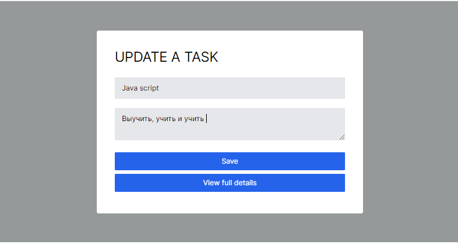
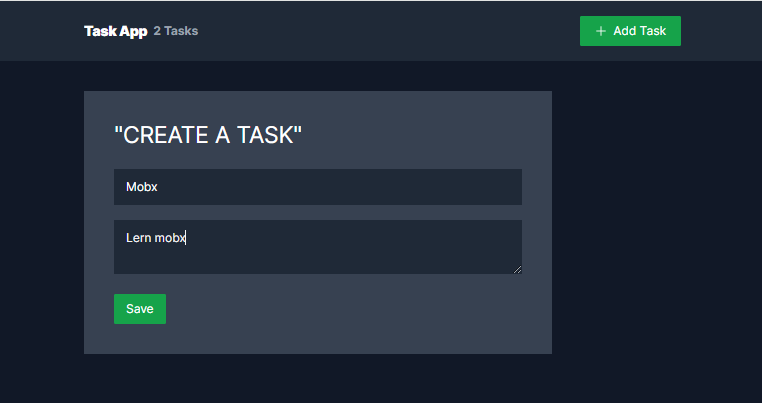
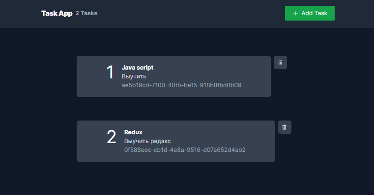

# Nextjs-todo-context-tailwind

#### A project built for resurrecting the countless abandonware repos littering GitHub. The goal is to make it easier to turn any repo, no matter how old, and turn it into a working GitHub Codespace.
#### Showcasing the use of local storage in Next.js with TypeScript, utilizing hooks and Redux.
[//]: # (Thank  for you choosing. We hope you enjoy this release, and we look forward to enhancing your note-taking journey in the future!)

## 📖 TODO
- Recycle knowledge and refresh mind
- < code />

-------------------------------------------------

### ⚙️ Technology Stack


-------------------------------------------------
### 📝 Local State management
Context data is stored in local storage.

[//]: # (![Reducer]&#40;https://img.shields.io/badge/Reducer-%2320232a.svg?style=for-the-badge&logo=react&logoColor=%2361DAFB&#41;)


-------------------------------------------------
### ‍💻 Getting Started
```bash
npm run dev
# or
yarn dev
```
-------------------------------------------------
## ⚙️ Advancement
The demo app is a static site, a basic single-page-app that has a few
addressable pages that are lazy loaded on-demand. It demonstrates basic CRUD
operations: 1) list todo, 2) view todo details, 3) create/edit and 4)
delete a todo.

The demo uses browser localStorage for the data storage, which means it runs
without a backend.  

#### A project built for resurrecting the countless abandonware repos littering GitHub. The goal is to make it easier to turn any repo, no matter how old, and turn it into a working GitHub Codespace.

### 📸 Screenshots





### 🌐 Learn More

>This is a [Next.js](https://nextjs.org/) 
> Work in Progress

Original project : [`nextjs-context-crud`](https://github.com/fazt/nextjs-context-crud) переделан https://github.com/fazt/nextjs-context-crud .

#### 💡 Additional:
react-hot-toast:
```bash
npm install react-hot-toast
```
Toaster
```bash
npm install react-hot-toast
```
import { toast } from "react-hot-toast";

#### 💡 Additional:
```bash
npm install @headlessui/react
```
```bash
npm install uuid
```
```bash
npm install react-icons --save
```

### Getting Started

First, run the development server:

```bash
npm run dev
# or
yarn dev
```

Open [http://localhost:3000](http://localhost:3000) with your browser to see the result.

### 🎁 Expected outcome
- ✅ Your project must be hosted on GitHub. (you can use the gh-pages to have a running version online or vercel)
- ✅ Your project must contain a README that explains how to run it.
- ✅ If some user stories are not clear enough, you can take arbitrary decisions.
- ✅ If you don't have time to finish all the user stories, describe the way you'd do them.
- ✅ Describe the edges you don't handle.
- ✅ This project is a real use case at todo List, put the same attention to this project that you would in your real work.


-------------------------------------------------
-------------------------------------------------
-------------------------------------------------
### 🔧 Functionality

The Task Management App have following functionalities:

- Title: A title describing the task.
- Status: The current status of the task (e.g., "To Do", "In Progress", "Completed").
- CRUD: Functionality to perform CRUD (Create, Read, Update, Delete).
- Stores the task data using local storage.

-------------------------------------------------
### 📄 Project Structure

The repository follows the following structure:

- `/public`: Contains public assets and the app's logo.
- `/src`: Contains children folders like "app", "components", and "store".
- `/src/app`: Contains the main page of the application.
- `/src/components`: Contains reusable components used throughout the application.

[//]: # (- `/src/store`: Contains the MST models and store for state management.)

-------------------------------------------------

